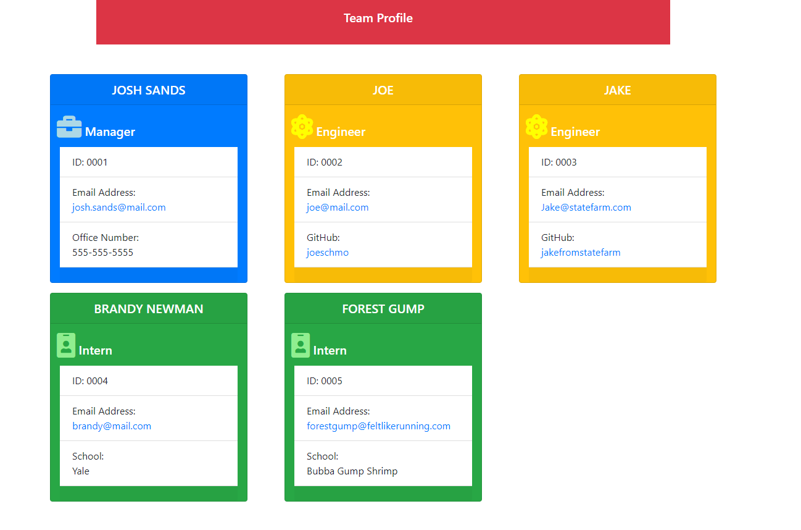

# team-profile-generator

## License

## Table of Contents
1. [Project Description](#project-description)
2. [Installation Instructions](#installation-instructions)
3. [Usage Information](#usage-information)
4. [Contributor Guidelines](#contributor-guidelines)
5. [Testing Instructions](#testing-instructions)
6. [License Info](#license-info)
7. [Questions](#questions)

## Visual Demonstration

[USER INPUT AND FILE GENERATION DEMO VIDEO HERE](https://youtu.be/V5Nhmg0zUVs)

[TESTING DEMO VIDEO HERE](https://youtu.be/yxP3g2sbh34)

## Project Description
* The above snapshot shows an example of what the profile will look like after the user answers all the questions. The video link shows a full demonstration on how this application works. The application prompts a user for information about their team which will then add an individual card with that team member's information.

## Installation Instructions
* Pull the Github repository to your local drive, open it in an IDE and enter "npm install inquirer" in the terminal to install the inquirer node modules in the root folder. You will also need to enter "npm install jest" if you want to run the tests.

## Usage Information
* Open terminal to the root directory and enter "node app" and answer the prompts that follow. After answering all the questions, the index.html file will generate with a card for each member entered.

## Contributor Guidelines
* [Submit bugs and feature requests](https://github.com/joshsands/team-profile-generator/issues).
* Review [source code changes](https://github.com/joshsands/team-profile-generator/pulls).
* Review the [documentation](https://github.com/joshsands/team-profile-generator-docs) and make pull requests for anything from typos to new content.

## Test Instructions
* After you install the jest module, you can enter "npm run test" in the terminal to test the constructor functions. You can also create your own mock data to run the tests without the defined constructors in the test files.

## License Info
Copyright 2021
The source code for the site is licensed under the MIT license and can be found at the link below:
[License Info Link](https://opensource.org/licenses/MIT)
      

## Questions?
* Find me on Github at [Joshsands](http://github.com/Joshsands).
* E-mail me at josh.sands@mail.com.
